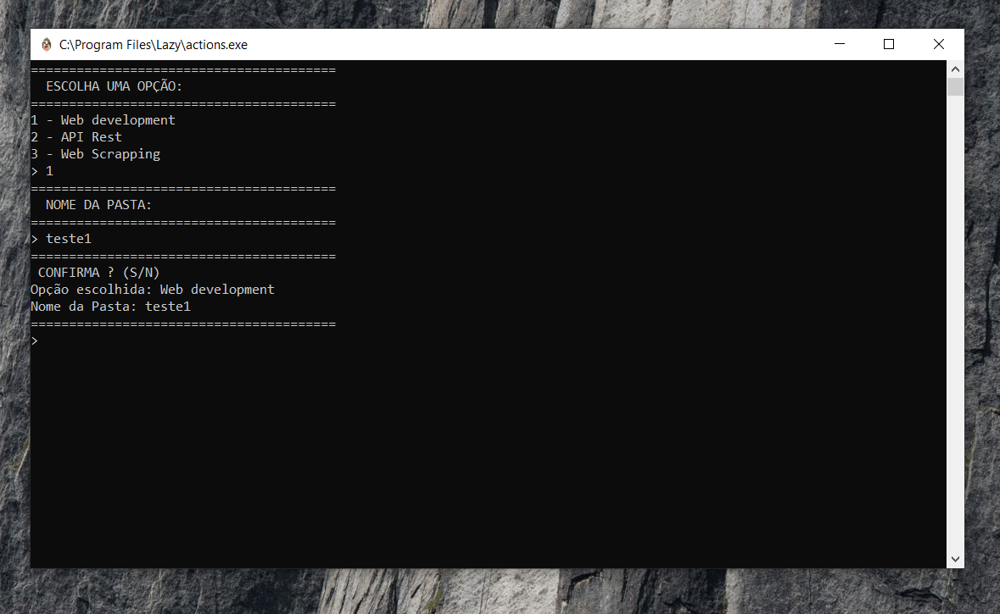
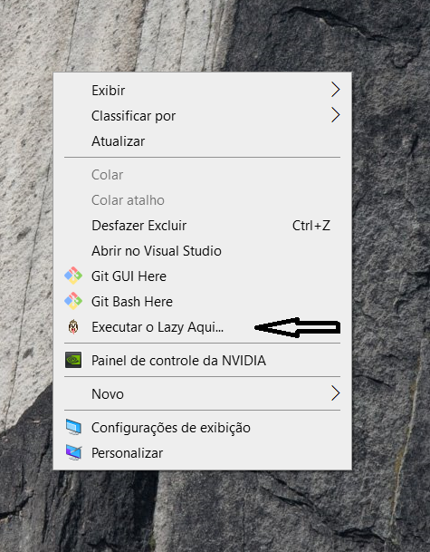
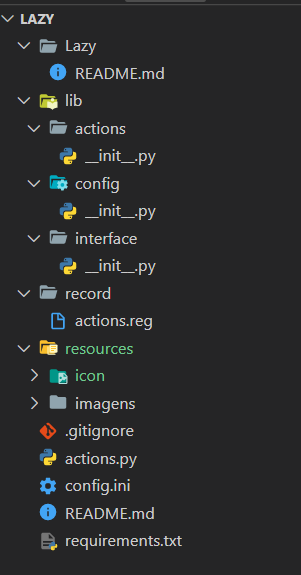

<p align="center">
  <a href="http://ant.design">
    
  </a>
</p>

<h1 align="center"> Time optimization application developed by<a href="https://www.linkedin.com/in/suspir0n/"> Evandro Silva! </a></h1>


## Description 

This project illustrates an example of optimization, using the python language for this, with it you can create your automatic design pattern.

## Demostration

 


## Training Scope

The purpose of the application is to demonstrate how simple it is to optimize something you always do, such as:

- Creating __folders__ and __files__.
- Basic __README__ creation
- Among others

## Starting

To run the project, you will need to install the following programs:

- [Python: Required to create the project](https://www.python.org/downloads/windows/)
- [VS Code: For project development](https://code.visualstudio.com/)

## ⌨️ Development

Use Gitpod, a free online dev environment for GitHub.

[](https://gitpod.io/#https://github.com/Suspir0n/lazy)
Or use code locally using:
```
cd "Directory of your preference"
git clone https://github.com/Suspir0n/lazy
```

### Construction

To run a python project, run the commands below:

``
python "your_file.py"
``
The "python" command will run your program in the terminal.


To start the project, perform some necessary dependencies below:

``
pip3 install configparser
pip3 install pathvalidate
pip3 install pyinstaller
``
The "pip3" command will download the dependency you requested.

to download your program's .exe file, run this command here:

``
pyinstaller --onefile --icon="name_of_icon.ico" "name_of_file.py"
``

## Windows registry

create a file "name_of_file.reg" and add this to it with the path of your executable so that it adds a shortcut on the right windows button:

``
Windows Registry Editor Version 5.00

[HKEY_CLASSES_ROOT\Directory\Background\shell\"name_of_project"]
@="Run from 'name_of_project' here..."
"Icon"="C:\\Program Files\\"name_of_project"\\"name_of_icon.ico""

[HKEY_CLASSES_ROOT\Directory\Background\shell\"name_of_project"\command]
@="\"C:\\Program Files\\"name_of_project"\\"name_of_executable.exe"\" \"%v.\""
``

## Project structure



__OBS:__ This initial organization is my standard that I use.

## WARNING

Do not forget to upload the .json files and their file models to a server, for them to download.

- My model json 

``
[
  {
    "type": "Web development",
    "actions": {
        "folders": ["app/lib", "tests", "resources/icons", "resources/imagens"],
        "files": [{
          "from": "http://127.0.0.1/samples/README.md",
          "to": ""
        }, {
          "from": "http://127.0.0.1/samples/requirements.txt",
          "to": ""
        }, {
          "from": "http://127.0.0.1/samples/.gitignore",
          "to": ""
        }, {
          "from": "http://127.0.0.1/samples/__init__.py",
          "to": ""
        }]
    }
  }, {
    "type": "API Rest",
    "actions": {
        "folders": ["app/lib", "tests"],
        "files": [{
          "from": "http://127.0.0.1/samples/README.md",
          "to": ""
        }, {
          "from": "http://127.0.0.1/samples/requirements.txt",
          "to": ""
        }, {
          "from": "http://127.0.0.1/samples/.gitignore",
          "to": ""
        }, {
          "from": "http://127.0.0.1/samples/__init__.py",
          "to": ""
        }]
    }
  }, {
    "type": "Web Scrapping",
    "actions": {
        "folders": ["app/lib", "tests", "resources/icons", "resources/imagens"],
        "files": [{
          "from": "http://127.0.0.1/samples/README.md",
          "to": ""
        }, {
          "from": "http://127.0.0.1/samples/requirements.txt",
          "to": ""
        }, {
          "from": "http://127.0.0.1/samples/.gitignore",
          "to": ""
        }, {
          "from": "http://127.0.0.1/samples/__init__.py",
          "to": ""
        }]
    }
  }
]
``


## Features

The project can be used as a template to create your pattern of organizing your project's folders and files using python. It also demonstrates in a practical way how to add your .exe in the windows shortcut.

## Configuration

To execute the project, it is necessary to use  VS Code or an IDE of your preference, so that it identifies the dependencies necessary for execution in the repository. Once the project is imported, it will be possible to test its functionality in real time.

## Contributions

Contributions are always welcome! I hope that it will help someone!

